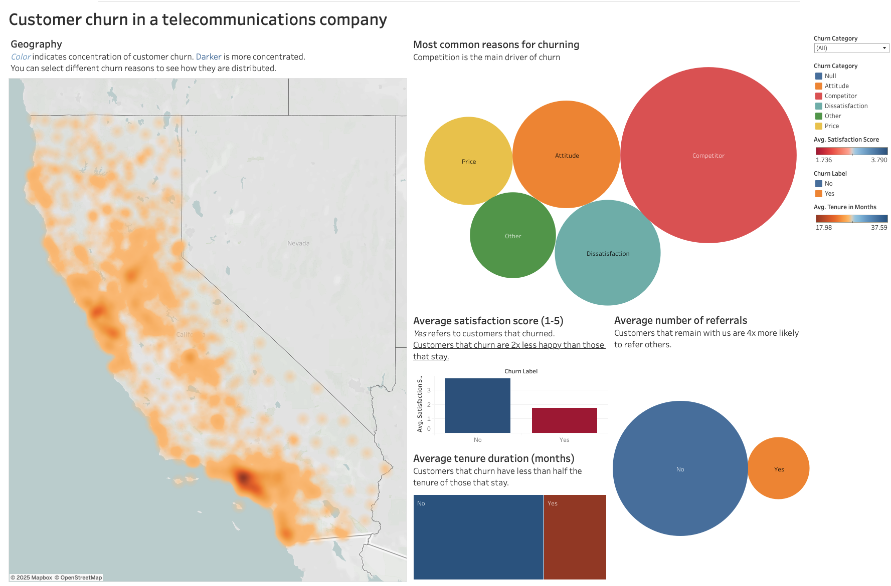

# Telecommunications customer churn

EDA and modeling of telecom customer churn using scikit-learn, pandas and jupyter notebook. Problem inspired on the [Kaggle Telco customer churn](https://www.kaggle.com/datasets/blastchar/telco-customer-churn/data) challenge, using [IBM data](https://accelerator.ca.analytics.ibm.com/bi/?perspective=authoring&pathRef=.public_folders%2FIBM%2BAccelerator%2BCatalog%2FContent%2FDAT00148&id=i9710CF25EF75468D95FFFC7D57D45204&objRef=i9710CF25EF75468D95FFFC7D57D45204&action=run&format=HTML&cmPropStr=%7B%22id%22%3A%22i9710CF25EF75468D95FFFC7D57D45204%22%2C%22type%22%3A%22reportView%22%2C%22defaultName%22%3A%22DAT00148%22%2C%22permissions%22%3A%5B%22execute%22%2C%22read%22%2C%22traverse%22%5D%7D) ([data description here](https://community.ibm.com/community/user/businessanalytics/blogs/steven-macko/2019/07/11/telco-customer-churn-1113)). 

[My executive summary and lessons learned](https://rsnemmen.github.io/projects/1_churn/) from this case study can be found here.

The model that ended up having the best performance (95% accuracy on validation!) was a simple logistic regression, presumably because the Mock data was generated using this model with some perturbations.

